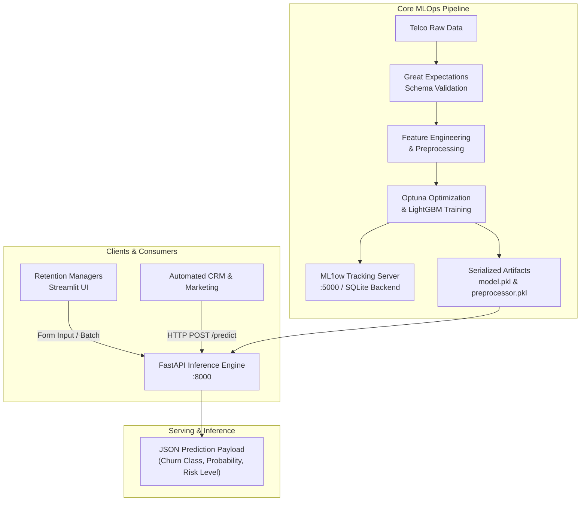

# 🔮 Telecommunications Customer Churn Prediction System (`ChurnAI`)

[](https://python.org)
[](https://fastapi.tiangolo.com)
[](https://churn-prediction.streamlit.app)
[](https://lightgbm.readthedocs.io)
[](https://mlflow.org)
[](https://www.docker.com/)

An end-to-end, production-grade MLOps platform for real-time Telecommunications Customer Churn Prediction. Powered by an Optuna-tuned **LightGBM** classifier, a high-performance **FastAPI** inference backend, and a modern **Streamlit** dark-mode dashboard interface.

🚀 **Live Interactive App**: [https://churn-prediction.streamlit.app](https://churn-prediction.streamlit.app)

---

## 📌 Executive Overview

Customer churn poses a major financial challenge in telecommunications. Retaining an existing subscriber costs up to 5×–25× less than acquiring a new customer. **ChurnAI** empowers retention teams to preemptively identify at-risk subscribers and execute targeted retention offers before customers disconnect.

* **Primary Objective**: Detect churn risk early with high precision and recall.
* **Key ML Metric**: **Recall $\ge 95\%$** (prioritizing detection of true churners to minimize costly False Negatives).
* **Model Class**: Optuna Bayesian-optimized **LightGBM Classifier**.
* **Experiment Artifact**: [`NOTEBOOKS/experiment.ipynb`](./NOTEBOOKS/experiment.ipynb) — Ground truth for EDA, Optuna hyperparameter tuning, MLflow tracking, and model evaluations.

---

## 📚 Project Documentation Hub

For a comprehensive technical and architectural breakdown, refer to the documentation suite in the [`docs/`](./docs) folder and the experiment source notebook:

| Document | Description | Key Focus |
| :--- | :--- | :--- |
| 📓 [**experiment.ipynb**](./NOTEBOOKS/experiment.ipynb) | **Experiment Source Notebook** | Full EDA, feature engineering, Optuna hyperparameter tuning, MLflow logging, and evaluation. |
| 📄 [**01_PRD.md**](./docs/01_PRD.md) | **Product Requirement Document** | Business problem, user personas, success metrics, and LTV retention strategy. |
| 🏗️ [**02_ARCHITECTURE.md**](./docs/02_ARCHITECTURE.md) | **System Architecture & Pipeline Design** | MLOps workflow, Great Expectations, Docker orchestration, and system diagrams. |
| 🤖 [**04_MODEL_CARD.md**](./docs/04_MODEL_CARD.md) | **Model Performance & Lineage** | Hyperparameters, evaluation metrics (Recall, ROC-AUC, F1), baseline comparisons. |
| 🔌 [**05_API_DOCUMENTATION.md**](./docs/05_API_DOCUMENTATION.md) | **REST API Technical Reference** | FastAPI `/predict` and `/health` request/response schemas and risk categories. |

---

## 🏗️ System Architecture



---

## ⚡ Key Features

* **High-Performance Inference**: LightGBM model with ultra low inference latency $< 3\text{ ms}$.
* **Strict Payload Validation**: FastAPI backend enforcing type validation via Pydantic schemas (`ChurnInputSchema`).
* **Automated Data Quality**: Schema verification pipeline using **Great Expectations**.
* **Experiment Lineage**: Full tracking of parameters, metrics, and models logged to **MLflow** (see [`NOTEBOOKS/experiment.ipynb`](./NOTEBOOKS/experiment.ipynb)).
* **Containerized Deployment**: Multi-container setup with **Docker Compose** (`churn-api`, `churn-frontend`, `mlflow-server`).
* **Modern Dark-Mode UI**: Sleek, responsive Streamlit dashboard with real-time risk scoring and risk-band categorization.

---

## 📊 Model Performance Highlights

Evaluated on unseen test set ($N=1,407$ in [`NOTEBOOKS/experiment.ipynb`](./NOTEBOOKS/experiment.ipynb)):

| Metric | Score | Business Impact |
| :--- | :---: | :--- |
| **Recall (Churn = 1)** | **$95.2\%$** | Successfully detects $\approx 95\%$ of actual churners (minimizes False Negatives). |
| **Precision (Churn = 1)** | **$38.2\%$** | Broad screening strategy to flag potential churners for targeted retention offers. |
| **F1-Score (Churn = 1)** | **$54.5\%$** | Harmonic balance between Precision and Recall. |
| **Accuracy** | **$57.8\%$** | Reflects recall-prioritized operating threshold ($0.35$). |
| **Inference Latency** | **$2.3\text{ ms}$** | Ultra fast prediction speed suitable for high-throughput real-time APIs. |

---

## 📁 Repository Structure

```
churn_prediction/
├── app/
│   ├── frontend.py            # Streamlit dark-themed UI app
│   ├── main.py                # FastAPI REST API application
│   └── schema.py              # Pydantic input/output validation schemas
├── config/
│   └── config.yaml            # Pipeline & model hyperparameters
├── docs/                      # Extensive project documentation
│   ├── 01_PRD.md              # Product Requirement Document
│   ├── 02_ARCHITECTURE.md     # System Architecture & Pipeline Design
│   ├── 04_MODEL_CARD.md       # Model Performance Card
│   └── 05_API_DOCUMENTATION.md # REST API Documentation
├── data/                      # Raw & processed datasets
├── great_expectations/        # Data validation expectations & suite
├── NOTEBOOKS/
│   └── experiment.ipynb       # EDA, model training & Optuna experiments (Source File)
├── src/                       # Modular python packages (data, features, models)
├── Dockerfile                 # Container environment definition
├── docker-compose.yaml        # Multi-container service orchestrator
├── pyproject.toml             # Project environment definition
├── requirements.txt           # Python package dependencies
└── README.md                  # Main project landing page
```

---

## 🚀 Quickstart Guide

### Option 1: Run via Docker Compose (Recommended)

1. **Clone the repository**:
   ```bash
   git clone https://github.com/nilayDawn/churn_prediction.git
   cd churn_prediction
   ```

2. **Launch all services via Docker Compose**:
   ```bash
   docker-compose up --build
   ```

3. **Access Services**:
   * **Streamlit UI**: `http://localhost:8501`
   * **FastAPI Docs (Swagger)**: `http://localhost:8000/docs`
   * **MLflow UI**: `http://localhost:5000`

---

### Option 2: Local Python Execution

1. **Install Dependencies**:
   ```bash
   pip install -r requirements.txt
   ```

2. **Start FastAPI Backend**:
   ```bash
   uvicorn app.main:app --host 0.0.0.0 --port 8000
   ```

3. **Start Streamlit Frontend**:
   ```bash
   streamlit run app/frontend.py
   ```

---

## 🌐 Live Streamlit Deployment

The Streamlit web dashboard is configured for deployment on **Streamlit Community Cloud**:

* **App Name**: `churn_prediction`
* **Deployment URL**: [https://churn-prediction.streamlit.app](https://churn-prediction.streamlit.app)

---

## 🤝 License

Distributed under the MIT License. See `LICENSE` for more information.