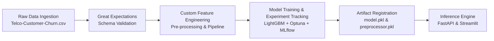
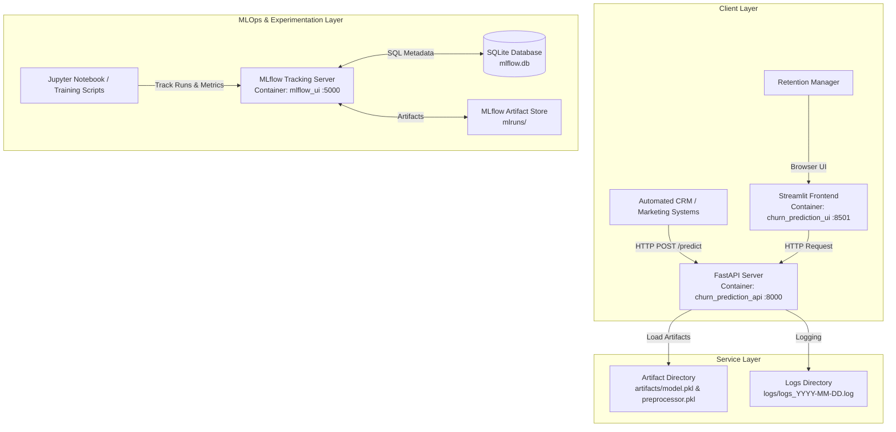

# System Architecture & Pipeline Design — Customer Churn Prediction

## 1. Purpose
This document outlines the end-to-end MLOps system architecture, data pipeline, tech stack decisions, and container orchestration layout for the Telco Customer Churn Prediction platform.

---

## 2. Data Pipeline Flow

1. **Ingestion**: Raw CSV datasets (`data/raw/Telco-Customer-Churn.csv`) are ingested into Pandas dataframes.
2. **Schema Validation (Great Expectations)**: Ensures data integrity, checking column names, types, expected value sets (e.g. `Contract` values, non-negative `tenure` and `MonthlyCharges`), and non-null constraints before downstream processing.
3. **Custom Feature Engineering**: Encodes categorical variables, handles numerical scaling, imputes missing values in `TotalCharges`, and generates custom interaction features.
4. **Model Training & Experiment Tracking**: LightGBM model training with Optuna hyperparameter optimization. Metrics, parameters, and model artifacts are tracked via MLflow.
5. **Model Inference**: Model artifacts (`model.pkl`, `preprocessor.pkl`) are loaded into memory on startup by FastAPI for low-latency batch and online inference.

---

## 3. Tech Stack Rationale

| Technology | Role | Key Rationale |
| :--- | :--- | :--- |
| **LightGBM** | Machine Learning Classifier | High execution speed, low memory footprint, handles mixed categorical/numerical feature distributions efficiently, native handling of imbalanced datasets via `class_weight="balanced"`. |
| **MLflow & SQLite** | Experiment Tracking & Model Registry | Provides reproducible tracking of hyperparameter trials, metric histories (Recall, ROC-AUC, F1), and model versioning stored in a centralized SQLite database (`mlflow.db`). |
| **FastAPI & Pydantic** | Production REST API Engine | High-performance asynchronous execution; Pydantic schemas (`ChurnInputSchema`) guarantee strict request payloads, automatic type conversion, and runtime error validation. |
| **Streamlit** | Interactive User Interface | Rapid deployment of an intuitive dashboard (`app/frontend.py`) for non-technical Retention Managers to run real-time inference and inspect customer churn risk scores. |
| **Docker & Docker Compose** | Multi-Container Orchestration | Multi-container setup isolating API, Frontend, and MLflow UI services into reproducible container runtime environments. |

---

## 4. System & Container Diagram

---

## 5. Containerization Strategy

The application is orchestrated using `docker-compose.yaml` with three isolated services:

1. **`churn-api`**: FastAPI service running Uvicorn on port `8000`. Exposes `/health` and `/predict`.
2. **`churn-frontend`**: Streamlit service running on port `8501`. Communicates with `churn-api` via internal Docker network (`http://churn-api:8000`).
3. **`mlflow-server`**: MLflow UI service running on port `5000` backed by `mlruns/` and `mlflow.db`.
